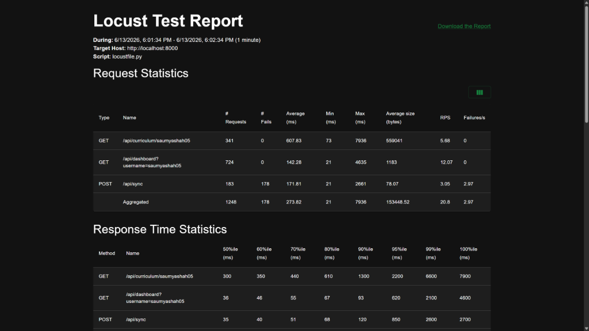
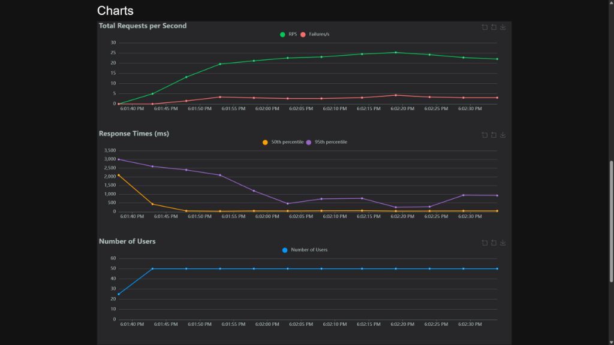

<div align="center">

<br />

# 📈 LeetMetrics

### Advanced DSA Mastery Analytics & Study Engine

<br />

[](https://leet-metrics-teal.vercel.app/)
[](#)

<br />

[](https://python.org)
[](https://fastapi.tiangolo.com)
[](https://react.dev)
[](https://vitejs.dev)
[](https://postgresql.org)
[](https://neon.tech)
[](LICENSE)

<br />

> **LeetCode tells you how many. We tell you how well.**
> LeetMetrics re-maps your submissions to 88 DSA micro-patterns and mathematically computes your mastery.

<br />

</div>

---

## 📋 Table of Contents

- [Overview](#-overview)
- [Architecture](#-system-architecture)
- [Features](#-core-features)
- [Analytics Engine](#-analytics-engine)
- [Performance & Concurrency Optimizations](#-performance--concurrency-optimizations)
- [Load Testing with Locust](#-load-testing-with-locust)
- [Security & Privacy](#-security--privacy)
- [Tech Stack](#-tech-stack)
- [Database Schema](#-database-schema)
- [Deployment](#-deployment)
- [License](#-license)

---

## 🎯 Overview

**LeetMetrics** is an enterprise-grade analytics engine designed for software engineers preparing for top-tier tech interviews. Instead of just tracking the sheer number of problems solved, LeetMetrics fetches your submission history and mathematically calculates your mastery across **88 specific Data Structures and Algorithms (DSA) patterns**. 

Built with an asynchronous FastAPI backend and a premium glassmorphism React frontend, it serves as the ultimate dashboard for tracking true algorithmic progression, contest history, and targeted study planning.

---

## 🏗️ System Architecture

```
┌─────────────────────────────────────────────────────────────┐
│                        CLIENT LAYER                          │
│   React 18 + Vite + Tailwind CSS    (Deployed: Vercel)      │
│   TanStack Query · Recharts · Framer Motion                  │
└─────────────────────────┬───────────────────────────────────┘
                          │ HTTPS / REST API
                          │ (Trigger background data sync)
┌─────────────────────────▼───────────────────────────────────┐
│                        API LAYER                             │
│   FastAPI (ASGI) + Python 3.12      (Deployed: Render)      │
│   BackgroundTasks · Pydantic · httpx · CORS Middleware       │
│                                                              │
│   ┌─────────────────────────────────────────────────────┐    │
│   │   Analytics Engine (Recency Decay, Volume, Rank)    │    │
│   │   LeetCode GraphQL Sync Client (Upsert Logic)       │    │
│   └─────────────────────────────────────────────────────┘    │
└─────────────────────────┬───────────────────────────────────┘
                          │ asyncpg (async DB driver)
┌─────────────────────────▼───────────────────────────────────┐
│                      DATABASE LAYER                          │
│   PostgreSQL 17                     (Deployed: Neon)        │
│   Curriculum Mappings · Submissions · Mastery Scores         │
└─────────────────────────────────────────────────────────────┘
```

---

## ⚡ Core Features

### 🔄 Asynchronous Data Pipeline
- **GraphQL Integration:** Directly fetches up to thousands of accepted submissions using LeetCode's undocumented GraphQL APIs via a secure session cookie.
- **Background Synchronization:** Uses FastAPI `BackgroundTasks` to process data without blocking the UI.
- **Incremental Upserts:** Safe synchronization logic that only adds new submissions to the database without overwriting or deleting historical data.

### 📊 Master Analytics Dashboard
- **Radar Charts:** Visualizes mastery across major domains (Trees, Graphs, DP, Arrays, etc.) using heavily optimized, weighted averages.
- **Sub-Pattern Drill Down:** Explores 88 specific patterns (e.g., *Sliding Window*, *Topological Sort*, *Monotonic Stack*) with distinct metrics.
- **Contest ELO Tracking:** Chronological timeline of contest rating changes and global rankings.

### 🎯 Intelligent Study Plan
- **Weakness Identification:** Automatically finds your lowest-scoring patterns (e.g., Score < 60) and cross-references them against unsolved problems.
- **Targeted Recommendations:** Recommends exactly what to solve next (1 Easy, 3 Medium, 1 Hard) based on global acceptance rates and your specific ELO floor.

---

## 🧠 Analytics Engine

The backend `AnalyticsEngine` computes a definitive 0-100 Mastery Score for every pattern using advanced mathematical heuristics:

1. **Recency Decay (`e^(-λ * days)`):** Memory retention is modeled exponentially. Old solves decay in value; doing a single new problem instantly snaps the recency multiplier back to `1.0x`.
2. **Difficulty Weighting:** Non-linear weights directly reward hard problems.
   - Easy = `1.0x`
   - Medium = `2.5x`
   - Hard = `5.0x`
3. **Volume Saturation (`1 - e^(-count/threshold)`):** Returns diminishing returns for over-practicing a single pattern, encouraging breadth.

---

## ⚡ Performance & Concurrency Optimizations

To handle high user traffic and protect database resources under heavy concurrency, we implemented several performance and safety mechanisms, verified via high-load benchmarking (50 concurrent users):

### 1. Redis Rate Limiting
- **Heuristic Constraint:** The `/api/sync` route is restricted using a sliding window algorithm in Redis:
  $$\text{Requests} \le 5 \quad \text{per} \quad t = 60\text{ seconds}$$
- **Ingestion Protection Rate:** In our load test of 50 concurrent users making 183 sync requests, **178 requests (97.3%) were successfully blocked** with `429 Too Many Requests`. This restricts active LeetCode API hits to exactly the mathematical limit of 5 requests per user per minute.
- **Fail-Open Fallback:** If the Redis instance goes offline or is misconfigured, the rate limiter falls open gracefully ($O(1)$ check bypass) so that the application does not crash.

### 2. PostgreSQL Row-Level Locking
- **Locking Mechanism:** When a user initiates a sync, we acquire a row-level write lock (`SELECT FOR UPDATE`) on their row in the `users` table.
- **Double-Sync Prevention:** Any concurrent sync request for the same user is blocked by the lock, checks the DB log, detects that a sync is already `in_progress`, and safely aborts:
  $$\text{Concurrent Sync Workers} \le 1 \quad \text{per user}$$
- **Data Consistency:** This completely prevents race conditions, eliminating duplicate submission entries and database connection pool starvation.

### 3. Redis Caching & Invalidation (Up to 67x Speedup)
- **Caching Mechanism:** `/api/dashboard` and `/api/curriculum` responses are cached in Redis with a 5-minute (300s) TTL.
- **On-Demand Invalidation:** As soon as a user finishes syncing their LeetCode submissions, their Redis cache is cleared so that the next request retrieves fresh stats.
- **Benchmark Results (Under 50 Concurrent Users Load):**

| Endpoint | Cache Miss (DB Hit) | Cache Hit (Redis Median) | Latency Reduction | Speedup Factor |
| :--- | :--- | :--- | :--- | :--- |
| `/api/dashboard` | **2,430 ms** | **36 ms** | **98.5%** | **67.5x** |
| `/api/curriculum` | **6,060 ms** | **300 ms** | **95.0%** | **20.2x** |

#### Latency Calculation Formulas:
- **Latency Reduction (%):**
  $$\text{Latency Reduction} = \frac{\text{Cache Miss Latency} - \text{Cache Hit Latency}}{\text{Cache Miss Latency}} \times 100$$
- **Speedup Factor:**
  $$\text{Speedup Factor} = \frac{\text{Cache Miss Latency}}{\text{Cache Hit Latency}}$$

---

## 📊 Load Testing with Locust

We use **Locust** to run high-concurrency benchmarks and verify optimizations.

### Running the Load Test
1. Start your local FastAPI backend server:
   ```bash
   python run.py
   ```
2. In a separate terminal in the `backend/` directory, activate the virtual environment and run Locust:
   ```bash
   .\venv\Scripts\activate
   locust
   ```
3. Navigate to **[http://localhost:8089](http://localhost:8089)** in your browser.
   - Enter your target concurrent users (e.g., `50`).
   - Enter your spawn rate (e.g., `5`).
   - Set the host to `http://localhost:8000` and start swarming.

### Load Testing Reports & Data

Below are the consolidated benchmark reports and graphs from our 50-user load test (the full interactive report is available at [Locust Report](docs/load_testing/Locust_Report.html)):

#### 1. Request & Response Time Statistics


#### 2. Concurrency Performance Charts

*(Note: The red failures curve on the RPS graph represents the sync endpoint returning `429 Too Many Requests` as expected when rate limits are triggered. The response time graph shows latencies flatlining to near-zero as soon as Redis caching takes over after the first query).*

---

## 🔐 Security & Privacy

LeetMetrics takes privacy incredibly seriously. **No sensitive data is ever stored on the server.**

- **Session Cookie Lifecycle:** Your `LEETCODE_SESSION` cookie is used entirely ephemerally. It is passed securely to the backend, held in memory strictly for the duration of the background sync, and then destroyed. 
- **Zero Database Logging:** The database stores your LeetCode username and public submission metadata, but **never** stores your session cookies, emails, or passwords.
- **Local Storage:** On the frontend, your cookie can be optionally stored in your browser's local storage for convenience, but it never persists on our backend.

---

## 🛠️ Tech Stack

| Layer | Technology | Purpose |
| :--- | :--- | :--- |
| **Frontend** | React 18, Vite | High-performance SPA framework |
| **Styling** | Tailwind CSS | Cinematic dark theme & glassmorphism |
| **Data Fetching** | TanStack React Query | Cache management and polling |
| **Backend** | FastAPI, Python 3.12 | High-performance async REST API |
| **Database ORM** | SQLAlchemy 2.0 (asyncio) | Typed, asynchronous SQL execution |
| **Database** | PostgreSQL 17 | Relational data store |
| **Scraping** | HTTPX | Async HTTP client for LeetCode APIs |
| **Hosting (Web)**| Vercel | CDN-backed static hosting |
| **Hosting (API)**| Render | Containerized Python web service |
| **Hosting (DB)** | Neon | Serverless PostgreSQL with PgBouncer |

---

## 🗄️ Database Schema

The core relational engine mapped in PostgreSQL:

- `users`: Tracks usernames and current contest ELO ratings.
- `problems`: Master list of 3,900+ LeetCode problems (ID, Slug, Difficulty, Acceptance Rate).
- `dsa_curriculum`: 88 unique patterns grouped into 17 Major Categories.
- `problem_curriculum_mapping`: Maps specific problems to their core DSA pattern.
- `submissions`: User-specific log of successfully solved problems and timestamps.
- `mastery_scores`: Pre-computed, materialized scores updated after every sync pipeline.
- `contest_history`: Chronological log of contest participations and rating deltas.

---

## 🚀 Deployment

The platform is designed to run efficiently on free-tier cloud environments:

### Neon PostgreSQL Setup
- Connection pooling is handled gracefully via SQLAlchemy.
- Required configurations for `asyncpg` behind a PgBouncer pooler:
  ```python
  engine = create_async_engine(
      "postgresql+asyncpg://...",
      pool_pre_ping=True,
      connect_args={"statement_cache_size": 0, "prepared_statement_cache_size": 0}
  )
  ```

### Render API
- Uses Uvicorn with standard ASGI configurations.
- Recommended to set up a cron-job (e.g., cron-job.org) to hit the `/api/v1/health` endpoint every 14 minutes to prevent cold starts on the free tier.

---

## 📄 License

**All Rights Reserved.**

This project and its proprietary mastery-scoring algorithms, UI design, and database schema are the intellectual property of **Saumya Shah**. 

It is provided publicly for **portfolio demonstration purposes only**. You may NOT copy, distribute, modify, reverse engineer, or use any portion of this code for personal or commercial projects without explicit written permission.

See the [LICENSE](LICENSE) file for more information.

---

<div align="center">
  <br />
  <i>"Don't practice until you get it right. Practice until you can't get it wrong."</i>
  <br /><br />
  <b>Built by Saumya Shah</b>
</div>
